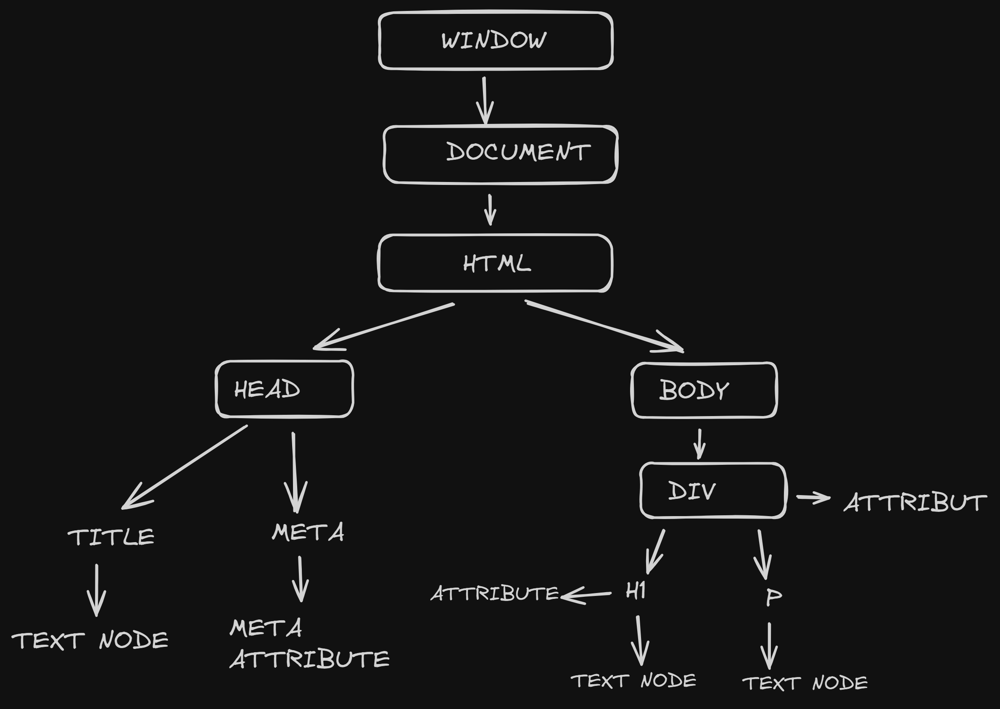

```javascript
console.log(window) // gives the all the elements in the window
console.dir(document)// gives the detailed document present in the window
console.log(document) // this will give the information only about the html document
```

Layout for the proposed html in this folder



DOM Selector for selecting elements from document

Syntax:

`document.getElementById("{id of that element}" `

`document.querySelector("id or classname of that element")`

`document.querySelectorAll("id or classname of that element") // it gives a nodelist as output`

`document.getElementsByClassName("enter classname ") // it gives html collections `

```javascript
document.getElementById("title")
document.querySelector("#title")
document.querySelectorAll("ul li")
document.getElementsByClassName("ul li")
```

Checking the values recived from the DOM

1. Getting the id of the element

   ```javascript
   console.log(document.getElementById("title").id); // will provide the id for the element received from the dom
   ```
2. Getting the ClassName of the element

   ```javascript
   console.log(document.getElementById("title").className); // will provide the class name for the element
   ```
3. Getting the Attribute from the element

   ```javascript
   console.log(document.getElementById("title").getAttribute('yourAttributeName')); // will provide the the atrribute value
   ```
4. Setting the Attribute of the element

   ```javascript
   console.log(document.getElementById("title").setAttribute('attribute-name','attribute-value')); // it will update the attribute value
   ```

Saving the Element into a variable

```javascript
const title = document.getElementById("title");
```

Styling the Element  using JS

```javascript
title.style.backgroundColor = 'green'
title.style.padding='15px'
title.style.borderRadius = '20px'
// we can add more styles like this only and follow the camel 
```

Adding Content to the element

```javascript
console.log(title.textContent)
console.log(title.innerText)
console.log(title.innerHTML)
```

Difference Between TextContent and innerText and innerHTML

```javascript
title.innerText -> gives the value that is visible or whose dispay is set to block or visible
```

```javascript
title.textContent -> gives the value whose display property is set to none also with all other text
```

```javascript
title.innerHTML -> gives the content even the html present inside the element
```
