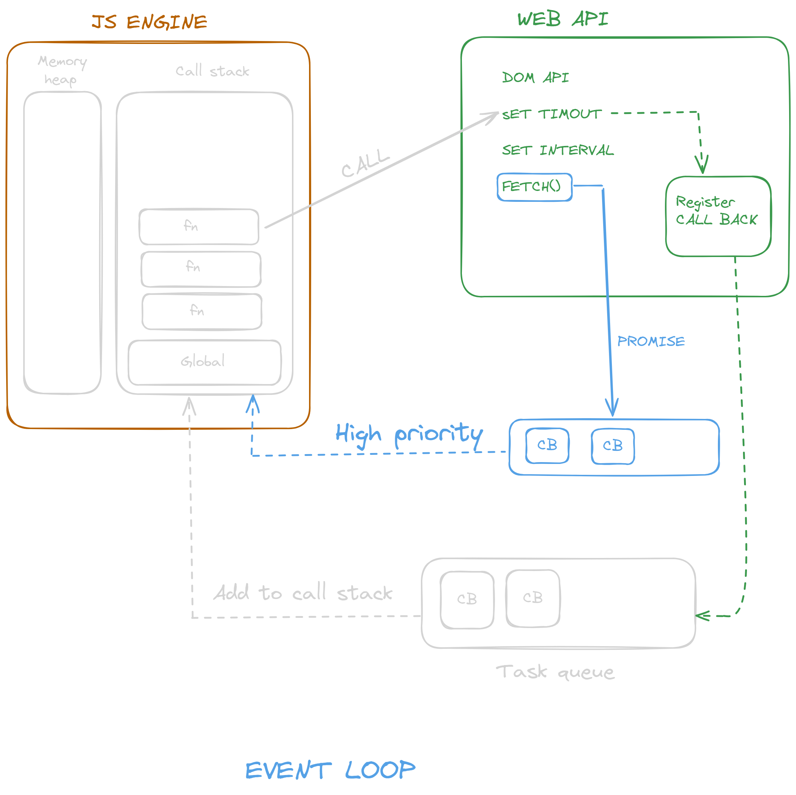

# Async (Asynchornous) in JS

### Javasript Default behaviour

Javascipt is  Synchonous it uses thread to execute the code It is Single threaded means it work only on one thread but this happen only when you'll work on a javascript engine .

But the good point is there will be no standalon javascript engines they are all runtime environments which enhances the performance

### Execution context

Execute one line of code at a time

when the previous statement doesn't gets executed the new operation won't be executing

each operation waits for the last one to complete befoer executing

## Blocking code VS Non Blocking code

### Blocking

it will block the flow of the program until a statement it completely executed

### Non Blocking code

Does'nt block the flow of the program even if the statement is not executed compeletly

## Event loop

